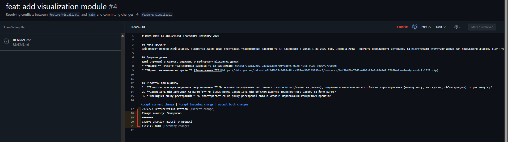

# Звіт з лабораторної роботи №1

## Виконав: Капустяк Роман (ШІ-33) [repo link](https://github.com/RomanKapustiak/open-data-ai-analytics)

## Опис модулів:
1. **data_load**: Скрипт `get_data.py` для завантаження та розпакування ZIP-архіву.
2. **data_quality_analysis**: Перевірка пропусків та типів даних у реєстрі.
3. **data_research**: Аналіз популярності марок та типів палива.
4. **visualization**: Побудова графіків розподілу даних датасету.

## Робота з Git:
- Використано систему feature-гілок.
- Реалізовано та розв'язано конфлікт у `README.md`.


## Лог репозиторію:
```bash
$ git log --oneline --graph --decorate --all
* fcda517 (HEAD -> main, tag: v0.1.0, origin/main) chore: add changelog and prepare release
* 508ddf9 feat: add data visualization module and update readme status (#4)
| *   e50ffc6 (origin/feature/visualization, feature/visualization) Merge branch 'main' into feature/visualization
| |\
| |/
|/|
* | bebf5c1 feat: add data research module and update readme status (#3)
| * 76d96a4 feat: add data visualization module and update readme status
|/
| * f75ff05 (origin/feature/data_research, feature/data_research) feat: add data research module and update readme status
|/
* 5317645 feat: add data quality analysis notebook and update status (#2)
| * 339ecfc (origin/feature/data_quality_analysis, feature/data_quality_analysis) feat: add data quality analysis notebook and update status
|/
* 384461f feat: add data loading module (#1)
| * 569cab9 (origin/feature/data_load, feature/data_load) feat: add data loading module
|/
:...skipping...
* fcda517 (HEAD -> main, tag: v0.1.0, origin/main) chore: add changelog and prepare release
* 508ddf9 feat: add data visualization module and update readme status (#4)
| *   e50ffc6 (origin/feature/visualization, feature/visualization) Merge branch 'main' into feature/visualization
| |\
| |/
|/|
* | bebf5c1 feat: add data research module and update readme status (#3)
| * 76d96a4 feat: add data visualization module and update readme status
|/
| * f75ff05 (origin/feature/data_research, feature/data_research) feat: add data research module and update readme status
|/
* 5317645 feat: add data quality analysis notebook and update status (#2)
| * 339ecfc (origin/feature/data_quality_analysis, feature/data_quality_analysis) feat: add data quality analysis notebook and update status
|/
* 384461f feat: add data loading module (#1)
| * 569cab9 (origin/feature/data_load, feature/data_load) feat: add data loading module
|/
* 65def82 docs: add project and data description
* 2fada9b chore: init

```
