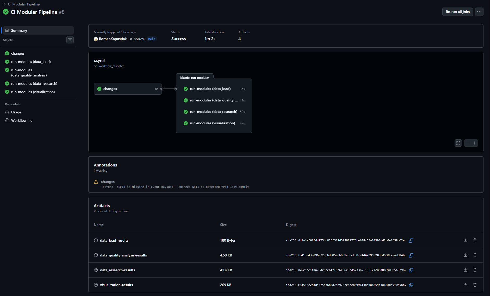
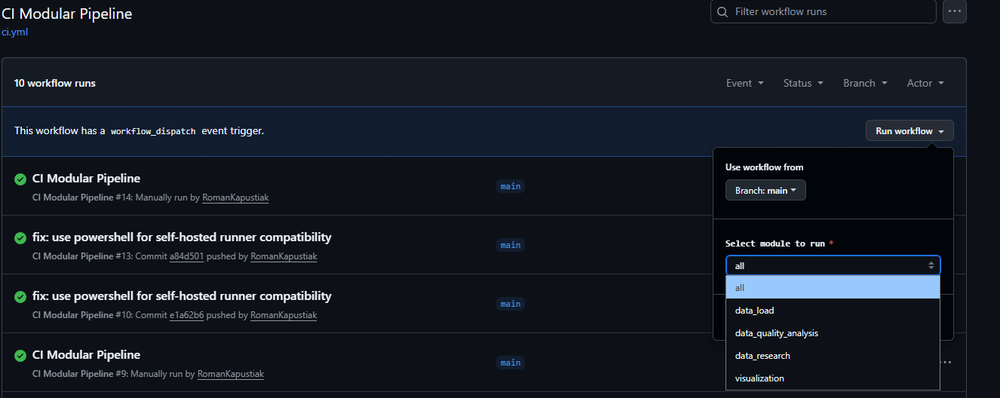
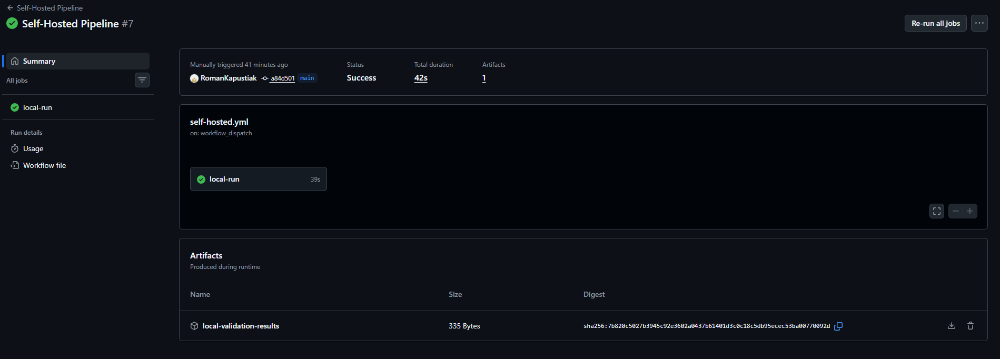

# Звіт з лабораторної роботи №2: Побудова CI-конвеєра
**Тема:** Побудова CI-конвеєра із використанням GitHub Actions
**Виконав:** Капустяк Роман (Група ШІ-33)

---

## Мета роботи
1. Налаштувати **CI**: автоматичний запуск модульних задач (тести/лінт/збірка/перевірки) при push/pull_request.
2. Налаштувати **CD (умовно)**: публікація артефактів (логів, звітів, графіків) та/або деплой результатів (наприклад, у GitHub Pages) після успішного CI.
3. Навчитись запускати pipeline:
   * на **GitHub-hosted runners** (хмара GitHub),
   * на **self-hosted runners** (локальний ПК/сервер/WSL).
---

## Опис реалізації конвеєрів

### 1. Головний Workflow (GitHub-hosted)
Конфігурація знаходиться у файлі `.github/workflows/ci.yml`.
* **Тригери:** Пайплайн запускається автоматично при пуші в `main`, при створенні PR, а також підтримує ручний запуск (`workflow_dispatch`) з вибором конкретного модуля.
* **Matrix Strategy:** Використовується для паралельного запуску чотирьох модулів проєкту.
* **Path Filters (Bonus):** За допомогою `dorny/paths-filter` реалізовано логіку «розумного» запуску: якщо зміни торкнулися лише одного модуля (наприклад, тільки візуалізації), інші три модулі не витрачають ресурси та пропускаються.

### 2. Локальний конвеєр (Self-hosted Runner)
Конфігурація знаходиться у файлі `.github/workflows/self-hosted.yml`. 
* **Середовище:** Раннер розгорнуто на локальній машині Windows.
* **Особливості:** Для уникнення конфліктів середовища використано пряму вказівку на локальне віртуальне оточення (`.venv`) та оболонку PowerShell.
* **Призначення:** Локальний раннер виконує інтеграційне тестування модуля завантаження даних та перевірку синтаксису всього коду.

---

## Порівняння раннерів

За результатами запусків було складено порівняльну характеристику:

| Характеристика            | GitHub-hosted (Cloud)          | Self-hosted                                    |
|:--------------------------|:-------------------------------|:-----------------------------------------------|
| **Операційна система**      | Linux (Ubuntu)                 | 	Windows 10/11 **                              |
| **Час виконання завдань** | Стабільний, але обмежений      | **Швидше** (завдяки прямому доступу до дисків) |
| **Ресурси** | Обмежені хмарою | **Локальний .venv / Диск D:** |
| **Оточення (Python)**     | Тимчасове (створюється з нуля) | Використання локального .venv                  |
| **Доступ до ресурсів**    | Лише інтернет                  | Локальні файлові системи, приватні мережі      |
| **Безпека** | Повна ізоляція | Ризик доступу до системи |
| **Швидкість**               | 55 с                           | 42 с                                           |

---

## Ризики використання Self-hosted Runners
* **Безпека:** Прямий доступ коду до хост-системи створює ризик компрометації приватних даних або несанкціонованого керування ресурсами сервера.
* **Адміністрування:** Повна відповідальність за оновлення ОС, патчі безпеки та підтримку актуальних версій ПЗ (Python, Git, бібліотеки).
* **Надійність:** Залежність від стабільності локальної інфраструктури (живлення, мережевий зв'язок, справність обладнання).
* **Ізоляція:** Відсутність гарантованого "чистого" середовища для кожного прогону, що може спричиняти конфлікти через залишкові файли або кеш.
---

## CD: Публікація артефактів
У проєкті налаштовано автоматичне збереження результатів (Artifacts). Після кожного успішного прогону GitHub зберігає:
1. **Виконані ноутбуки:** Файли `.ipynb` з уже побудованими графіками.
2. **Логи виконання:** Текстові файли з результатами роботи скриптів завантаження.
Це дозволяє переглядати актуальний стан аналітики без необхідності запускати код локально.

---

## Скріншоти

1. **Паралельне виконання (Matrix Run):** 
2. **Вибір модуля при ручному запуску:** 
3. **Робота локального раннера (Self-hosted):** 

---

## Висновки
В ході лабораторної роботи було побудовано гнучкий CI/CD конвеєр. Використання **матричної стратегії** дозволило паралелізувати обробку даних, а **фільтрація шляхів** забезпечила ефективне використання ресурсів. Налаштування **self-hosted раннера** продемонструвало переваги локального виконання для завдань, що потребують специфічного оточення або швидкого доступу до локальних ресурсів. Проєкт повністю відповідає вимогам автоматизації модульної розробки.
