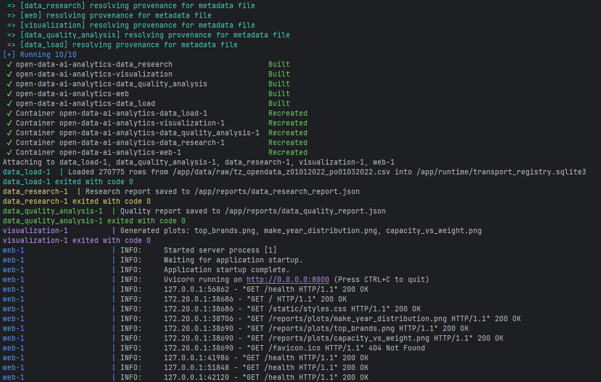
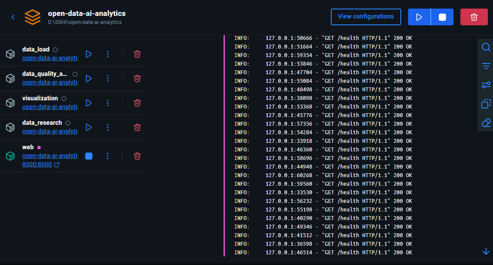
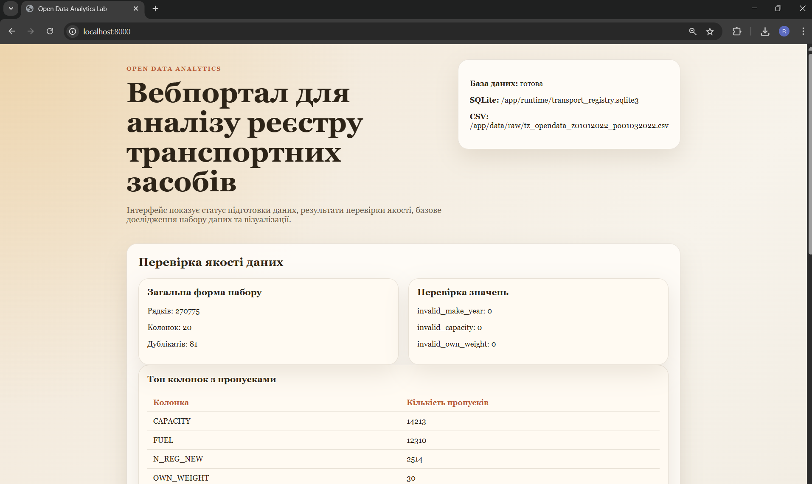

# Звіт з лабораторної роботи №3: Контейнеризація модулів проєкту за допомогою Docker
**Тема:** Контейнеризація модулів проєкту за допомогою Docker
## Виконав: Капустяк Роман (ШІ-33) [repo link](https://github.com/RomanKapustiak/open-data-ai-analytics)

---

## Мета роботи
Опанувати базові принципи контейнеризації застосунків та навчитися запускати окремі модулі проєкту в Docker-середовищі. Закріпити навички побудови багатомодульного проєкту, роботи з Dockerfile, Docker Compose, томами, мережами та контейнерною взаємодією між сервісами.

---

## Опис розгорнутих сервісів

Проєкт поділено на мікросервіси, кожен з яких розміщений у власному Docker-контейнері:

1. **`data_load`**: Відповідає за зчитування вхідного CSV-файлу та його зберігання у створеній базі даних (SQLite).
2. **`data_quality_analysis`**: Виконує перевірку даних (виявлення пропусків, дублікатів) та фіксує результати в JSON-звіті.
3. **`data_research`**: Обчислює базові статистики на основі набору даних.
4. **`visualization`**: Відповідає за побудову графіків розподілу та зберігає їх у форматі PNG для подальшого відображення.
5. **`web`**: FastAPI/Jinja-додаток, який надає інтерфейс користувача для перегляду звітів перевірок, статистик та згенерованих графіків.

---

## Організація взаємодії сервісів

Для орхестрації сервісів використовується `compose.yaml`.

* **Мережа:** Усі сервіси працюють у спільній bridge-мережі `analytics-net`, що забезпечує їхню приховану та безпечну взаємодію.
* **Спільні томи (Volumes):**
  * `./data` — містить сирі дані, передається для ініціалізації бази.
  * `./runtime` — використовується для збереження та доступу до файлу бази даних `transport_registry.sqlite3` між модулями.
  * `./reports` — спільне сховище для результатів: JSON-файли від аналітичних модулів та PNG-графіки від модуля візуалізації.
* **Залежності:** Використовується `depends_on` із `condition: service_completed_successfully`, щоб модулі `data_quality_analysis`, `data_research` та `visualization` чекали успішного збереження даних (`data_load`), а веб-інтерфейс `web` стартував лише після завершення агрегації результатів.

---

## Скріншоти результатів

1. **Запуск Docker Compose:**
   

2. **Запущені контейнери (Containers List):**
   

3. **Веб-інтерфейс із результатами:**
   

---

## Висновки
В ході лабораторної роботи було успішно контейнеризовано розроблений пайплайн аналітики відкритих даних. Застосування індивідуальних `Dockerfile` дозволило створити ізольовані середовища для кожного модуля. Використання `docker compose` суттєво спростило локальний запуск: обмін даними між процесами вдало налаштовано через volumes `runtime` та `reports`, а запуск системи цілком здійснюється однією командою. Труднощі, пов'язані з послідовністю запуску, були вирішені механізмом `depends_on: service_completed_successfully`, що дозволило автоматизувати весь цикл обробки даних від завантаження до відображення у веб-інтерфейсі.
